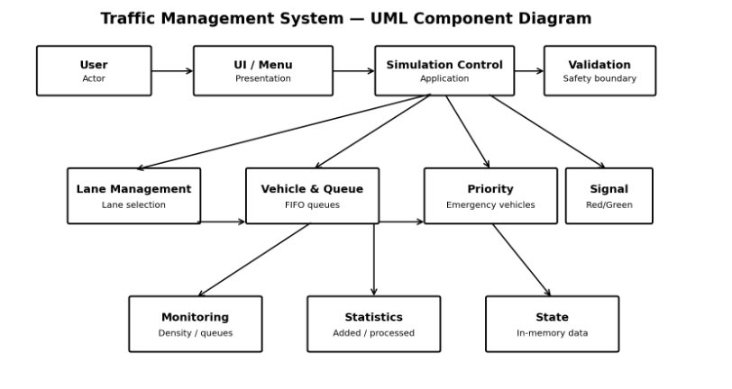
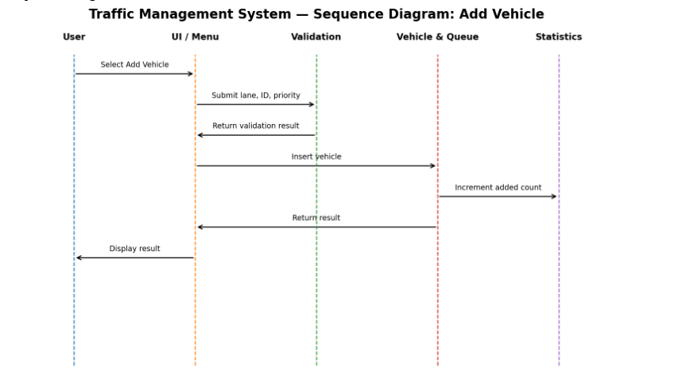
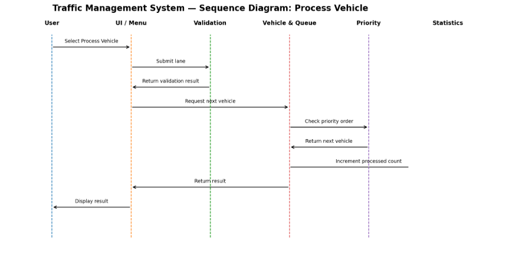

# Traffic Management System — Team 8

# SOFTWARE ARCHITECTURE AND DESIGN SPECIFICATION

Software Architecture and Design Specification
Project: ATM System

Version: 1.0

Authors: Team Number: Team 8

Instructor: Dr. Pradeep Kumar

## Team Members:

• PES2UG24CS131 — Chetan

• PES2UG24CS159 — Dimpal N

• PES2UG24CS176 — Halahally Shivaprasad Deeksha Prasad

• PES2UG24CS816 — Nikitha V

Date: 15-09-2025

Status: Draft

## Revision History
Version                 Date                     Author                  Change Summary
## 1.0                     14-09-2026               Team 8                  Initial SAD

## Approvals
Role                            Name                            Signature/Date
Instructor                      Dr. Pradeep Kumar

## 1. Introduction

## 1.1 Purpose
This document specifies the architecture and design of the Traffic Management System
(Simulation), translating the SRS into a modular design for vehicle management, lane
queues, traffic signals, emergency priority, monitoring, statistics, validation, reset, and exit.

## 1.2 Scope
The design covers a standalone console-based simulation of traffic through up to four lanes.
It does not control real-world traffic infrastructure.

## 1.3 Audience
Developers, testers, instructors, evaluators, and project team members.

## 1.4 Definitions
TMS—Traffic Management System; SRS—Software Requirements Specification; STP—
Software Test Plan; RTM—Requirements Traceability Matrix; Queue—FIFO traffic waiting
structure; Lane—independent traffic queue; Emergency Vehicle—priority vehicle; CLI—
Command-Line Interface; UML—Unified Modeling Language.

## 2. Document Overview

## 2.1 How to use this document
This document presents the architecture, modules, data structures, interfaces, security
considerations, sequence flows, error handling, and design rationale. It should be read with
the SRS and STP.

## 2.2 Related Documents
Traffic Management System SRS v1.0; Software Test Plan v1.0; Requirements Traceability
Matrix.

## 3. Architecture
## 3.1 Goals & Constraints
Goals: modularity, correct queue behavior, safe input handling, predictable response, maintainability,
and clear CLI interaction.
Constraints: C language, console execution, maximum four lanes, finite queue capacity, no
database/network service, simulation only.
## 3.2 Stakeholders & Concerns
Stakeholder                                       Concerns
System User                                       Simple interaction and correct processing
Instructor/Evaluator                              Requirement coverage and design clarity
Developer                                         Modularity and maintainability

## 3.3 Component (UML) Diagram
The following UML component diagram shows the main logical components and their
relationships.

. 3.4 Component Descriptions
Component                                     Responsibilities
UI/Menu                                       Display menu, collect commands, show
results
Vehicle/Queue                                 Add, process, and display vehicles
Lane Management                               Validate and isolate lanes
Priority                                      Handle emergency vehicle priority
Signal                                        Set/display Red or Green
Monitoring                                    Calculate density and queue size
Statistics                                    Track added/processed totals
Validation                                    Validate input and bounds
Simulation Control                            Reset state and exit
## 3.5 Chosen Architecture Pattern and Rationale
A modular layered architecture is chosen. The presentation layer handles CLI interaction;
the control layer coordinates operations; domain/data modules implement vehicles,
queues, priority, signals, monitoring, and statistics; validation provides a safety boundary.
This is simpler and more maintainable than a distributed or microservices architecture for a
standalone simulation.
## 3.6 Technology Stack & Data Stores
Area                                          Choice
Language                                      C
Execution                                     Console application
Data structures                               Structures and queue-based storage
Build                                         Standard C compiler such as GCC
Persistence                                   None; in-memory simulation state
External services                             None
## 3.7 Risks & Mitigations

Risk                                          Mitigation
Invalid input                                 Validate before access
Queue overflow                                Check capacity
Queue underflow                               Check empty state
Wrong priority                                Dedicated priority logic and tests
State inconsistency                           Centralize updates and reset

## 3.8 Traceability to Requirements
Vehicle/Queue → TMS-F-001–003; Lane Management → TMS-F-004–006; Signal/Priority →
TMS-F-007–009; Monitoring/Statistics → TMS-F-010–012; Control/Validation → TMS-F-
013–015; Quality/security → TMS-NF-001–005 and TMS-SR-001–005.

## 3.9 Security Architecture
•   Validate lane indices before access.
•   Enforce queue capacity before insertion.
•   Validate vehicle identifiers.
•   Treat input only as simulation data; do not execute OS commands.
•   Do not collect or display confidential personal information.

## 4. Design
## 4.1 Design Overview
The system initializes simulation state, presents a CLI menu, validates the selected
operation, updates in-memory state through the relevant module, and displays the result.
Each lane has an independent queue and emergency vehicles receive priority.
## 4.2 UML Sequence Diagrams
Sequence Diagram 1 — Add Vehicle

Step                        Component                     Interaction
1                           User                          Select Add Vehicle
2                           UI                            Request lane, ID, priority
3                           Validation                    Check input/capacity
4                           Queue/Priority                Insert vehicle
5                           Statistics                    Increment added count
6                           UI                            Display result

Sequence Diagram 2 — Process Vehicle

Step                        Component                      Interaction
1                           User                           Select Process Vehicle
2                           UI                             Request lane
3                           Validation                     Check lane
4                           Queue/Priority                 Select and remove next
vehicle
5                           Statistics                     Increment processed count
6                           UI                             Display result
## 4.3 API Design
This is a standalone C application and exposes no network API. Internal interfaces are
specified for design:
Interface              Operation               Inputs              Effect
Queue                  addVehicle()            lane, vehicle       Insert if
valid/capacity
available
Queue                  processVehicle()        lane                Remove/process next
vehicle
Monitoring             getDensity()            lane                Return density class
Signal                 setSignal()             state               Update signal state

## 4.4 Error Handling, Logging & Monitoring
•   Reject invalid menu/lane values without crashing.
•   Reject insertion into full queues.
•   Handle processing of empty queues safely.
•   Reject invalid vehicle IDs.
•   Do not display confidential information.
•   Display queue size, density, signal status, and statistics.

## 4.5 UX Design
The CLI uses a numbered menu, clear prompts, concise success/error messages, and explicit
status output.

## 4.6 Open Issues & Next Steps
•   Insert finalized UML component and sequence diagrams as graphics.
•   Verify exact queue capacity/density thresholds against the implemented code if specified
separately.
•   Complete STP and execute mapped tests.

## 5. Appendices
## 5.1 Glossary
TMS, SRS, STP, RTM, CLI, UML.
## 5.2 References
Traffic Management System SRS v1.0; Software Test Plan template; SAD template.
## 5.3 Tools
C compiler (e.g., GCC), Git/GitHub, PlantUML or draw.io, command-line environment.

---

# SOFTWARE TEST PLAN

Software Test Plan (STP) - Traffic Management System
(Simulation)

Project: Traffic Management System (Simulation)
Version: 1.0
Authors: Team Number: Team 8

Instructor: Dr. Pradeep Kumar

## Team Members:

• PES2UG24CS131 — Chetan

• PES2UG24CS159 — Dimpal N

• PES2UG24CS176 — Halahally Shivaprasad Deeksha Prasad

• PES2UG24CS816 — Nikitha V

Date: 15.9.2026
Status: Draft

## 1. Introduction

Purpose
This document defines objectives, scope, strategy, resources, schedule, responsibilities,
risks, traceability, and acceptance criteria for testing the Traffic Management System.
Scope
Testing covers vehicle addition/processing, queues, multiple lanes, signals, emergency
priority, density, statistics, reset, validation, exit, non-functional behavior, and security.
Real-world traffic hardware and infrastructure are excluded.
References
Traffic Management System SRS v1.0; Traffic Management System SAD v1.0; project source
and automated tests.
Definitions
TMS, FR, NFR, SR, RTM, TC.

## 2. Test Items
•   Vehicle/Queue module
•   Multiple Lane Management
•   Traffic Signal
•   Emergency Priority
•   Traffic Monitoring
•   Statistics
•   Simulation Control
•   Input Validation
•   CLI/User Interface
•   Security/Robustness

## 3. Features to be Tested
SRS IDs                                           Feature
TMS-F-001–003                                     Vehicle addition, processing, queue display
TMS-F-004–006                                     Multiple lanes, selection, empty/full queues
TMS-F-007–009                                     Signal and emergency priority
TMS-F-010–012                                     Density, queue monitoring, statistics
TMS-F-013–015                                     Reset, validation, exit
TMS-NF-001–005                                    Performance, reliability, robustness,
usability, maintainability
TMS-SR-001–005                                    Security validation

## 4. Features Not to be Tested
•   Real-world traffic signal hardware
•   Roadside sensors/vehicle hardware
•   External traffic infrastructure
•   Network/cloud backends
•   Database persistence, since current design is in-memory

## 5. Test Approach / Strategy
Levels
•     Unit testing — queue, validation, priority, signal, monitoring, statistics
•     Integration testing — module interactions
•     System testing — end-to-end CLI workflows
•     Acceptance testing — SRS acceptance criteria
Types
•   Functional
•   Boundary/negative
•   Regression

•    Performance
•    Usability
•    Security/robustness
•    Maintainability/static checks

Entry Criteria
Build compiles; environment and test data are ready; SRS and test cases are baselined.

Exit Criteria
100% planned cases executed; all high-priority criteria verified; 0 critical defects open;
complete requirement coverage.

## 5.1 Security Validation
- Validate lane bounds.

- Validate queue capacity.

- Test invalid vehicle IDs/input.

- Confirm input cannot execute OS commands.

- Confirm no confidential data is stored/displayed.

## 6. Test Environment
Area                                          Environment

Hardware                                      Standard development computer

Software                                      C compiler such as GCC; terminal;
executable

Repository                                    Git/GitHub

Tools                                         Compiler/test runner; GitHub Actions if
enabled; PlantUML/draw.io

Test Data                                     Normal/emergency vehicles, valid/invalid
lanes, empty/full queues, boundary input

## 7. Test Schedule
Milestones:
- Test case design: 05-Sep-2025
- Environment setup: 07-Sep-2025
- Test execution start: 08-Sep-2025

- Test execution end: 20-Sep-2025
- UAT: 22-Sep-2025 to 25-Sep-2025

## 8. Test Deliverables
- Test Plan (this document)
- Test Cases (manual & automated)
- Test Scripts
- Test Data
- Test Execution Logs
- Defect Reports
- Test Summary Report

## 9. Roles and Responsibilities
Role                           Name                          Responsibility

QA Lead                        Chetan                        Prepare plan, coordinate
execution

Test Engineer                  Dimpal N                      Design & execute test cases,
log defects

Developer                      Halahally Shivaprasad         Support defect fixes and
Deeksha Prasad                triage

Product Owner                  Nikitha V                     Approve test results, sign-
off readiness

## 10. Risks and Mitigation
Risk                                         Mitigation

Build instability                            Compile and smoke-test before execution

Queue boundary defects                       Dedicated empty/full tests

Priority defect                              Test normal and emergency vehicles
together

Incomplete coverage                          Maintain RTM

Environment differences                      Document compiler/environment

## 11. Assumptions & Dependencies
•    Project builds with a standard C compiler.
•    SRS is the behavior baseline.

•   Testers have source/executable access.
•   No external services are required.
•   Unspecified implementation details will be verified against finalized source/design.

## 12. Suspension & Resumption Criteria
Suspend testing if the application cannot compile/start, a blocking defect prevents more
than 30% of cases, or the environment is unavailable. Resume when blocking defects are
resolved, a stable build is available, and the environment/test data are restored.

## 13. Test Case Management & Traceability
Every SRS requirement is mapped to at least one test case.

Requirement ID                                Primary Test Case

TMS-F-001                                     TC-TMS-001

TMS-F-002                                     TC-TMS-002

TMS-F-003                                     TC-TMS-003

TMS-F-004                                     TC-TMS-004

TMS-F-005                                     TC-TMS-005

TMS-F-006                                     TC-TMS-006

TMS-F-007                                     TC-TMS-007

TMS-F-008                                     TC-TMS-008

TMS-F-009                                     TC-TMS-009

TMS-F-010                                     TC-TMS-010

TMS-F-011                                     TC-TMS-011

TMS-F-012                                     TC-TMS-012

TMS-F-013                                     TC-TMS-013

TMS-F-014                                     TC-TMS-014

TMS-F-015                                     TC-TMS-015

TMS-NF-001                                    TC-NF-001

TMS-NF-002                                  TC-NF-002

TMS-NF-003                                  TC-NF-003

TMS-NF-004                                  TC-NF-004

TMS-NF-005                                  TC-NF-005

TMS-SR-001                                  TC-SEC-001

TMS-SR-002                                  TC-SEC-002

TMS-SR-003                                  TC-SEC-003

TMS-SR-004                                  TC-SEC-004

TMS-SR-005                                  TC-SEC-005

## 14. Test Metrics & Reporting
Metrics collected:
- % test cases executed
- % passed/failed
- Defect density
- Defect aging
- Requirement coverage

Reports:
- Daily execution status
- Final Test Summary Report

## 15. Approvals
Role                          Name                        Signature / Date

QA Lead                       Chetan

Dev Lead                      Halahally Shivaprasad
Deeksha Prasad

Product Owner                 Nikitha V

Test Engineer                 Dimpal N
